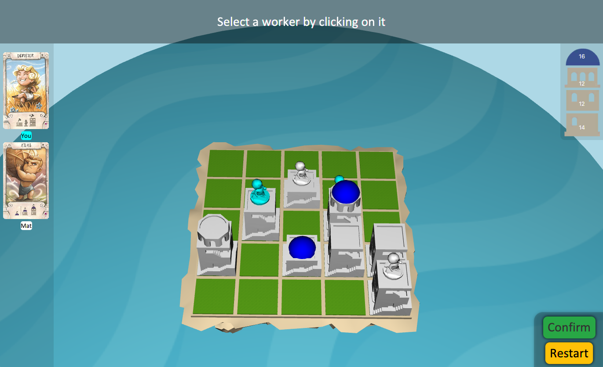
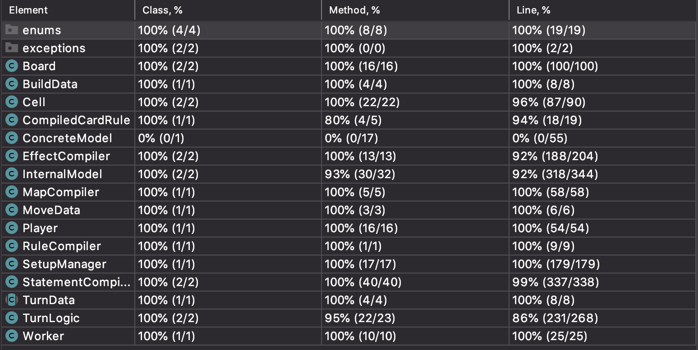
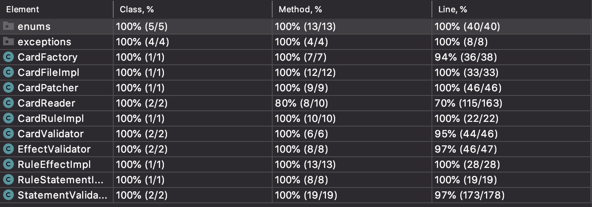

# Final project Software Engineering 2020
# Santorini


This repository contains a **Java** video game implementation of the board game *Santorini*. 
It has been developed for the course "Software Engineering" at Politecnico di Milano as part of the final examination projects for the Bachelor in Computer Engineering.
In a team of 3 students we implemented this multiplayer online game with 3D graphics.
In the game it is possible to play multiple concurrent matches. 
Sockets are used for asynchronous communication.
For this project we have been awarded the maximum grade of **30 cum laude/30**.

 

### Features

- **2-3 Online players**
- **GUI**: Play in a 3D rendered world
- **Multiple parallel online games**
- **Advanced gods**: Apart from the full rules and the basic gods, we implement advanced gods
- **Normal or hardcore game-modes**: In hardcore mode, illegal moves are allowed and make you loose the game. In normal mode, the allowed moves are displayed to the user which can only choose among them

## Section of Professor Alessandro Margara
## Group AM09

- ###   10568949    Andrea Aspesi ([@andreaaspesidev](https://github.com/andreaaspesidev))<br>andrea1.aspesi@mail.polimi.it
- ###   10580728    Matteo Bettini ([@matteobettini](https://github.com/matteomettini))<br>matteo1.bettini@mail.polimi.it
- ###   10560693    Mirko De Vita ([@MirkoDeVita98](https://github.com/MirkoDeVita98))<br>mirko.devita@mail.polimi.it

| Functionality  |       State        |
|:---------------|:------------------:|
| Basic rules    | :heavy_check_mark: |
| Complete rules | :heavy_check_mark: |
| Socket         | :heavy_check_mark: |
| GUI            | :heavy_check_mark: |
| CLI            | :heavy_check_mark: |
| Multiple games | :heavy_check_mark: |
| Advanced Gods  | :heavy_check_mark: |

<!--
[](#)
[](#)
[](#)
-->


## Setup

- In the [deliveries](deliveries) folder there are two multi-platform jar files, one to set the Server up and the other one to start the Client.
- The Server can be run with the following command, as default it runs on port 4567:
    ```shell
    > java -jar SantoriniServer.jar
    ```
  This command can be followed by these arguments:
  - **-port**: followed by the desired port number between MIN_PORT and MAX_PORT as argument;
  - **-v**: to activate logging on the console;
  - **-log**: followed by a file name, to activate logging both in the console and in the chosen file;
  - **-help**: to get help.
  
- The Client can be run with the following command:
    ```shell
    > java -jar SantoriniClient.jar
    ```
  - This command sets the Client on Graphical User Interface(GUI) mode, but it can be followed by **-cli** if the Command Line Interface(CLI) is preferred.
  - The Server's IP and port to connect to can be specified during the execution.
 
 ## Build
 Use maven to build jar files for both the Client and the Server by choosing the appropriate Maven Profile.  
 
 To build the Server, issue:  
    ```
       > mvn clean    
    ```  
    ```
      > mvn package -P Server    
    ```  
 <br>
 To build the Client, issue:  
    ```
        > mvn clean    
    ```  
    ```
       > mvn package -P Client    
    ```    
  
  After these processes both jars can be found in the builds folder.
 ## Extra
 
 Two game-modes are implemented:
 - **Normal**: the Server sends the possible moves/builds to the Client so that they are displayed to the Player during his/her turn.
 - **Hardcore**: in this mode there are no suggestions and the Player can lose if he/she does not obey to Gods' rules.
 
 ## Testing and Documentation
 
 The [model](src/main/java/it/polimi/ingsw/server/model) and [card](src/main/java/it/polimi/ingsw/server/cards)'s packages have been entirely tested and documentation of the project has been written using JavaDocs:
 
  - [JavaDoc](deliveries/JavaDoc)
 - <a href="deliveries/TestCoverage" title="Tests' Coverage Report">Tests' Coverage Report</a>
 
 
 

 
 ## Tools
 
 * [StarUML](http://staruml.io) - UML Diagram
 * [Maven](https://maven.apache.org/) - Dependency Management
 * [IntelliJ](https://www.jetbrains.com/idea/) - IDE
 * [JavaFX](https://openjfx.io) - Graphical Framework
 
 ## License
 
 This project is developed in collaboration with [Politecnico di Milano](https://www.polimi.it) and [Cranio Creations](http://www.craniocreations.it).
 
